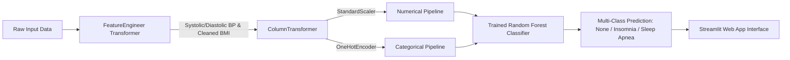

# Sleep Disorder Classification Using Machine Learning

[](https://www.python.org/)
[](LICENSE)
[](https://streamlit.io/)
[](tests/)

An end-to-end Machine Learning web application designed to classify sleep disorder status (**No Sleep Disorder / None**, **Insomnia**, and **Sleep Apnea**) based on lifestyle, cardiovascular, and demographic indicators. Built with **Scikit-Learn**, **Pandas**, and **Streamlit**.

---

## 1. Project Title
**Sleep Disorder Classification Using Machine Learning**  
*Machine Learning-Based Sleep Health Risk Stratification and Analytics*

---

## 2. Abstract
Sleep disorders significantly degrade human health, cognitive vitality, and cardiovascular longevity. However, traditional polysomnography (PSG) sleep tests are prohibitively expensive and time-consuming. This mini-project presents an end-to-end, multi-class machine learning system trained on the Sleep Health and Lifestyle dataset (374 individuals). The system integrates domain-specific feature engineering (blood pressure decomposition, BMI normalization) within a Scikit-Learn `Pipeline`. Five classification algorithms were benchmarked using 5-Fold Stratified Cross-Validation. The **Random Forest Classifier** achieved the highest performance with **96.00% Test Accuracy** and **0.9352 Test Macro F1-Score**. The pipeline is persisted and served through a modern, responsive **Streamlit** web application featuring real-time risk classification, probability estimates, and interactive EDA dashboards.

---

## 3. Introduction
Sleep is an essential biological process regulating memory consolidation, hormonal balance, immune health, and cellular repair. Over 30% of global adults suffer from acute or chronic sleep disturbances, with **Insomnia** and **Sleep Apnea** being the most prevalent. This project demonstrates how supervised machine learning can analyze non-invasive lifestyle attributes to provide early educational risk assessments.

---

## 4. Problem Statement
1. **Severe Underdiagnosis:** Millions of individuals with sleep apnea remain undiagnosed due to the friction and cost ($1,000–$3,000) of overnight laboratory sleep studies.
2. **Multi-Factor Complexity:** Sleep disorders result from interconnected lifestyle (stress, sleep hours, activity) and physiological (blood pressure, BMI, heart rate) markers.
3. **Lack of Accessible Screening:** Healthcare providers and individuals require an open-source, reproducible screening tool to evaluate sleep health status rapidly.

---

## 5. Objectives
- Classify patient health status into three mutually exclusive categories: `None`, `Insomnia`, and `Sleep Apnea`.
- Implement a reproducible, leakage-free Scikit-Learn preprocessing pipeline.
- Benchmark 5 supervised classification algorithms using 5-Fold Stratified Cross-Validation.
- Prioritize **Macro F1-Score** to protect sensitivity on minority classes.
- Build an interactive, modern Streamlit web dashboard.
- Provide 100% test coverage with automated unit and integration tests.

---

## 6. Dataset Description
The model is trained on the **Sleep Health and Lifestyle Dataset** (available on Kaggle):
- **Samples:** 374 individuals
- **Attributes:** 13 columns (1 identifier, 11 predictive features, 1 target)
- **Target Distribution:**
  - `None` (Healthy controls): **219 samples** (58.6%)
  - `Sleep Apnea`: **78 samples** (20.9%)
  - `Insomnia`: **77 samples** (20.6%)

### Predictive Feature Dictionary:
| Feature Name | Type | Description |
| :--- | :---: | :--- |
| `Gender` | Categorical | Biological sex (`Male`, `Female`) |
| `Age` | Numerical | Age in years (27 to 59) |
| `Occupation` | Categorical | 11 professions (Nurse, Doctor, Engineer, etc.) |
| `Sleep Duration` | Numerical | Average sleep duration in hours/day (5.8 to 8.5) |
| `Quality of Sleep` | Numerical | Subjective score (1 to 10) |
| `Physical Activity Level` | Numerical | Daily exercise in minutes (30 to 90) |
| `Stress Level` | Numerical | Subjective stress score (1 to 10) |
| `BMI Category` | Categorical | `Normal`, `Overweight`, `Obese` |
| `Blood Pressure` | Compound String | Formatted as `'Systolic/Diastolic'` (e.g. `'126/83'`) |
| `Heart Rate` | Numerical | Resting pulse in beats per minute (65 to 86) |
| `Daily Steps` | Numerical | Pedometer daily step count (3,000 to 10,000) |

---

## 7. Technologies Used
- **Python:** 3.10+ (tested on Python 3.14.8)
- **Data Manipulation:** `pandas`, `numpy`
- **Machine Learning:** `scikit-learn`
- **Visualization:** `matplotlib`, `seaborn`
- **Model Serialization:** `joblib`
- **Web Application:** `streamlit`
- **Testing:** `pytest`
- **Version Control:** `git`, `github`
- **Deployment:** `Streamlit Community Cloud`

---

## 8. Project Architecture



---

## 9. Data Preprocessing
Implemented in `src/preprocessing.py`:
1. **Target Imputation:** In the raw dataset, 219 missing target values (`NaN`) denote asymptomatic individuals with no sleep disorders. These are cleanly mapped to `'None'`.
2. **Identifier Removal:** Non-predictive `Person ID` is automatically dropped.
3. **Compound Blood Pressure Decomposition:** Parsed `'126/83'` into continuous variables: `Systolic_BP` (126.0 mmHg) and `Diastolic_BP` (83.0 mmHg).
4. **BMI Category Standardization:** Normalized synonym `'Normal Weight'` to `'Normal'`.
5. **ColumnTransformer:**
   - Numerical (`SimpleImputer(median)` $\rightarrow$ `StandardScaler`)
   - Categorical (`SimpleImputer(most_frequent)` $\rightarrow$ `OneHotEncoder(handle_unknown='ignore')`)
6. **Leakage Prevention:** Transformers are fitted strictly on the 80% training split (`X_train`) within a single unified pipeline.

---

## 10. Exploratory Data Analysis
Twelve publication-grade visualizations are generated and saved to `images/generated_analysis_plots/`:
1. `01_target_distribution.png` — Target class proportions
2. `02_age_distribution.png` — Participant age histogram
3. `03_sleep_duration_distribution.png` — Sleep duration distribution (mean: 7.13 hrs)
4. `04_sleep_quality_distribution.png` — Sleep quality rating breakdown
5. `05_stress_level_distribution.png` — Stress score distribution
6. `06_physical_activity_distribution.png` — Physical exercise duration distribution
7. `07_bmi_category_distribution.png` — Standardized BMI categories
8. `08_sleep_duration_vs_disorder.png` — Sleep duration boxplot across disorder status
9. `09_stress_level_vs_disorder.png` — Stress level boxplot across disorder status
10. `10_sleep_quality_vs_disorder.png` — Sleep quality boxplot across disorder status
11. `11_bmi_category_vs_disorder.png` — Proportion of sleep disorders by BMI group
12. `12_correlation_heatmap.png` — Pearson correlation matrix across numerical metrics

### Key Statistical Insights:
- **Insomnia Signature:** Characterized by reduced sleep duration (< 6.5 hours) and high stress ($\ge 7$).
- **Sleep Apnea Signature:** Strongly concentrated among Overweight and Obese participants with systolic blood pressure exceeding 130 mmHg.
- **Healthy Profile:** Average sleep duration > 7.5 hours, sleep quality $\ge 8$, and stress level $\le 4$.

---

## 11. Algorithms Used
We evaluated 5 supervised classification algorithms:
1. **Logistic Regression** (`class_weight='balanced'`, `max_iter=1000`)
2. **Decision Tree Classifier** (`class_weight='balanced'`, `max_depth=5`)
3. **Random Forest Classifier** (`n_estimators=100`, `class_weight='balanced'`, `max_depth=6`)
4. **K-Nearest Neighbors** (`n_neighbors=5`, `weights='distance'`)
5. **Gradient Boosting Classifier** (`n_estimators=100`, `learning_rate=0.1`)

---

## 12. Model Evaluation
Evaluated using 5-Fold Stratified Cross-Validation on the training set (299 samples) and tested on the held-out test set (75 samples).

| Model | 5-Fold CV Accuracy | 5-Fold CV Macro F1 | Test Accuracy | Test Macro Precision | Test Macro Recall | Test Macro F1 | Test Weighted F1 |
| :--- | :---: | :---: | :---: | :---: | :---: | :---: | :---: |
| **Random Forest (Champion)** | **0.8762** | **0.8491** | **96.00%** | **0.9370** | **0.9347** | **0.9352** | **0.9599** |
| Gradient Boosting | 0.8762 | 0.8483 | 94.67% | 0.9163 | 0.9271 | 0.9214 | 0.9472 |
| K-Nearest Neighbors | 0.8562 | 0.8254 | 93.33% | 0.8983 | 0.9196 | 0.9082 | 0.9347 |
| Logistic Regression | 0.8828 | 0.8600 | 93.33% | 0.9077 | 0.9182 | 0.9076 | 0.9341 |
| Decision Tree | 0.8594 | 0.8329 | 93.33% | 0.9042 | 0.9091 | 0.8995 | 0.9329 |

---

## 13. Results

### Selected Champion Model: Random Forest
- **Test Set Accuracy:** **96.00%**
- **Test Set Macro F1-Score:** **0.9352**
- **Artifact:** Saved to `model/sleep_disorder_pipeline.joblib`

#### Per-Class Classification Report (Test Set):
- **None (Healthy):** Precision: `1.0000`, Recall: `1.0000`, F1: `1.0000` (44 samples)
- **Insomnia:** Precision: `0.9286`, Recall: `0.8667`, F1: `0.8966` (15 samples)
- **Sleep Apnea:** Precision: `0.8824`, Recall: `0.9375`, F1: `0.9091` (16 samples)

---

## 14. Installation

### Prerequisites:
- Python 3.10, 3.11, or 3.14 installed.
- Git installed.

### Step 1: Clone Repository
```bash
git clone https://github.com/rampradeep2025professional/sleep-disorder-prediction.git
cd sleep-disorder-classification
```

### Step 2: Create Virtual Environment
On Windows:
```cmd
python -m venv .venv
.venv\Scripts\activate
```

On macOS / Linux:
```bash
python3 -m venv .venv
source .venv/bin/activate
```

### Step 3: Install Dependencies
```bash
pip install -r requirements.txt
```

---

## 15. How to Run Locally

### 1. Retrain Models and Regenerate Evaluation Artifacts:
```bash
python train_model.py
```

### 2. Generate EDA Plots:
```bash
python generate_eda_plots.py
```

### 3. Run Automated Tests:
```bash
pytest -v tests/test_model.py
```

### 4. Launch Streamlit Application:
```bash
streamlit run app.py
```
Open your browser at `http://localhost:8501`.

---

## 16. Streamlit Application
The application provides 5 responsive sections:
- **Home:** Project summary, disorder definitions, and metric badges.
- **Predict:** Interactive multi-parameter form with dynamic blood pressure preview, prediction badges, and probability bar charts.
- **Dataset Insights:** Interactive EDA visual gallery and raw dataset viewer.
- **Model Performance:** Live benchmark comparison table, confusion matrix heatmaps, and per-class metrics.
- **About Project:** Architecture diagrams, engineering methodology, limitations, and references.

---

## 17. GitHub Setup
To publish this project to your GitHub account:

```bash
# 1. Initialize git
git init

# 2. Stage all project files
git add .

# 3. Create initial commit
git commit -m "Build sleep disorder classification ML project"

# 4. Set main branch
git branch -M main

# 5. Link your GitHub repository
git remote add origin https://github.com/rampradeep2025professional/sleep-disorder-prediction.git

# 6. Push to GitHub
git push -u origin main
```

---

## 18. Deployment Instructions (Streamlit Community Cloud)
1. Commit and push the repository to GitHub following Section 17.
2. Navigate to [Streamlit Community Cloud](https://share.streamlit.io/) and log in with your GitHub account.
3. Click **"New App"**.
4. In **Repository**, select your repository: `rampradeep2025professional/sleep-disorder-prediction`.
5. In **Branch**, select `main`.
6. In **Main file path**, enter `app.py`.
7. Click **"Deploy!"**.
8. Once built, test the live public URL and share your educational application.

---

## 19. Project Structure
```
sleep-disorder-classification/
├── app.py                                  # Main Streamlit web application
├── train_model.py                          # Model training, cross-validation & evaluation script
├── generate_eda_plots.py                   # Generates 12 EDA visualizations
├── generate_presentation_pptx.py           # PowerPoint deck generator
├── requirements.txt                        # Project dependencies
├── README.md                               # Project documentation & guide
├── report.md                               # College mini-project academic report
├── presentation.md                         # Presentation deck outline & speaker notes
├── presentation.pptx                       # 12-slide PowerPoint presentation
├── viva_questions.md                       # 30 comprehensive viva questions & answers
├── pytest.ini                              # Pytest configuration
├── .gitignore                              # Git exclusion rules
├── LICENSE                                 # MIT Open-Source License
├── data/
│   └── sleep_health.csv                    # Dataset (374 records)
├── model/
│   ├── sleep_disorder_pipeline.joblib      # Saved Scikit-Learn champion pipeline
│   ├── model_metrics.json                  # Performance metrics & confusion matrix JSON
│   ├── model_comparison.csv               # Algorithm comparison table
│   └── confusion_matrix.png                # Heatmap plot
├── notebooks/
│   └── sleep_disorder_analysis.ipynb       # Jupyter notebook for exploratory analysis
├── src/
│   ├── __init__.py
│   └── preprocessing.py                   # Feature engineering & ColumnTransformer
├── tests/
│   └── test_model.py                       # Automated test suite (12 tests)
└── images/
    └── generated_analysis_plots/           # 12 publication-quality analysis charts
```

---

## 20. Limitations
- **Sample Cohort Size:** 374 records is suitable for demonstration, but larger clinical datasets are needed for universal deployment.
- **Subjective Metrics:** Sleep Quality and Stress Level rely on subjective self-reporting (1–10).
- **Cross-Sectional Data:** Represents static snapshot observations rather than continuous overnight polysomnography (PSG).

---

## 21. Future Enhancements
- **Wearable Sensor Integration:** Streaming real-time PPG, heart rate variability (HRV), and accelerometer telemetry from smartwatches.
- **Deep Learning on Raw Signals:** Applying 1D-CNN or LSTM architectures directly to polysomnography biosignals.
- **Multi-Hospital Validation:** Clinical cohort expansion across multi-center sleep laboratories.

---

## 22. Disclaimer
“This application is developed for educational and machine-learning demonstration purposes only. Its predictions are based on patterns in the training dataset and are not a medical diagnosis. Model performance may be limited by dataset quality, class imbalance, and differences between training data and real-world users. Consult a qualified healthcare professional for medical concerns.”

---

## 23. References
1. American Academy of Sleep Medicine. (2014). *International Classification of Sleep Disorders* (3rd ed.).
2. Kaggle Dataset: Laksika Tharmalingam. *Sleep Health and Lifestyle Dataset*.
3. Pedregosa, F., et al. (2011). Scikit-learn: Machine Learning in Python. *Journal of Machine Learning Research*, 12, 2825-2830.
4. Breiman, L. (2001). Random Forests. *Machine Learning*, 45(1), 5-32.
5. Streamlit Documentation: https://docs.streamlit.io
